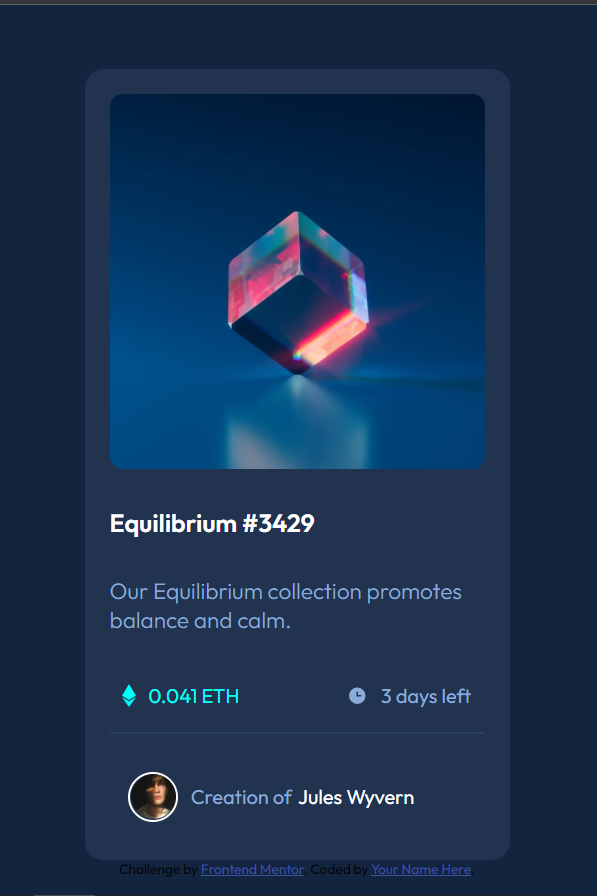

# Frontend Mentor - NFT preview card component solution

This is a solution to the [NFT preview card component challenge on Frontend Mentor](https://www.frontendmentor.io/challenges/nft-preview-card-component-SbdUL_w0U). Frontend Mentor challenges help you improve your coding skills by building realistic projects. 

## Table of contents

- [Overview](#overview)
  - [The challenge](#the-challenge)
  - [Screenshot](#screenshot)
  - [Links](#links)
- [My process](#my-process)
  - [Built with](#built-with)
  - [What I learned](#what-i-learned)
  - [Continued development](#continued-development)
  - [Useful resources](#useful-resources)
- [Author](#author)

**Note: Delete this note and update the table of contents based on what sections you keep.**

## Overview

### The challenge

Users should be able to:

- View the optimal layout depending on their device's screen size
- See hover states for interactive elements

### Screenshot




### Links

- Solution URL: (https://www.frontendmentor.io/solutions/mobilefirst-solution-using-css-grid-and-flexbox-c2VnOYxrU)
- Live Site URL: (https://blurryface1998.github.io/NFT-preview-card-component/)

## My process

### Built with

- Semantic HTML5 markup
- CSS custom properties
- Flexbox
- CSS Grid
- Mobile-first workflow
- [Gulp.js] (https://gulpjs.com/)
- [Styled Components](https://styled-components.com/) - For styles

### What I learned

I used display: flex to setup price and time elements:

```scss
 &__price {
      display: flex;
      align-items: center;
      flex-direction: row;
      flex-wrap: nowrap;
 }
  &__time {
      display: flex;
      align-items: center;
      flex-direction: row;
      flex-wrap: nowrap;
  }
```


### Continued development

I'm gonna focus working on CSS Grid because I'm not 100% sure how to use it properly.

### Useful resources

- [Example resource 1](https://www.youtube.com/watch?v=rg7Fvvl3taU) - This helped me for Css Grid. I really liked this pattern and will use it going forward.
- [Example resource 2](https://www.youtube.com/watch?v=duH4DLq5yoo&t=311s)


## Author

- Website - [Djordje Rajc]
- Frontend Mentor - [@Blurryface1998](https://www.frontendmentor.io/profile/Blurryface1998)
- Twitter - [@Blurryface_1998](https://twitter.com/Blurryface_1998)

